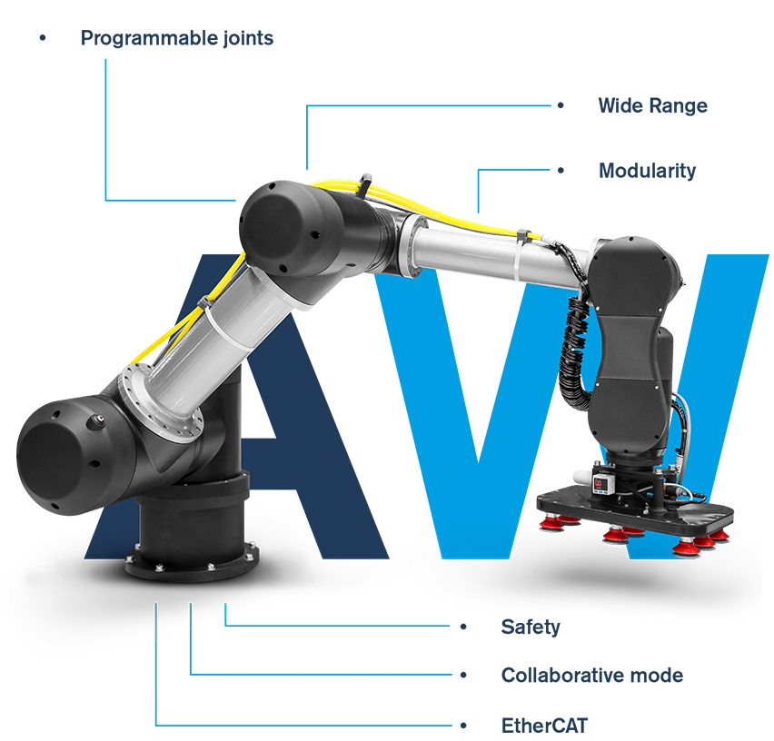

.. awtube documentation master file, created by
   sphinx-quickstart on Mon Mar 11 08:38:25 2024.
   You can adapt this file completely to your liking, but it should at least
   contain the root `toctree` directive.

awtube python library docs
==========================

.. toctree::
  :maxdepth: 2
  :glob:
  :caption: Contents:

  intro
  robot
  types
  trajectories
  awtube

Indices
=======
* :ref:`genindex`
* :ref:`modindex`
* :ref:`search`
